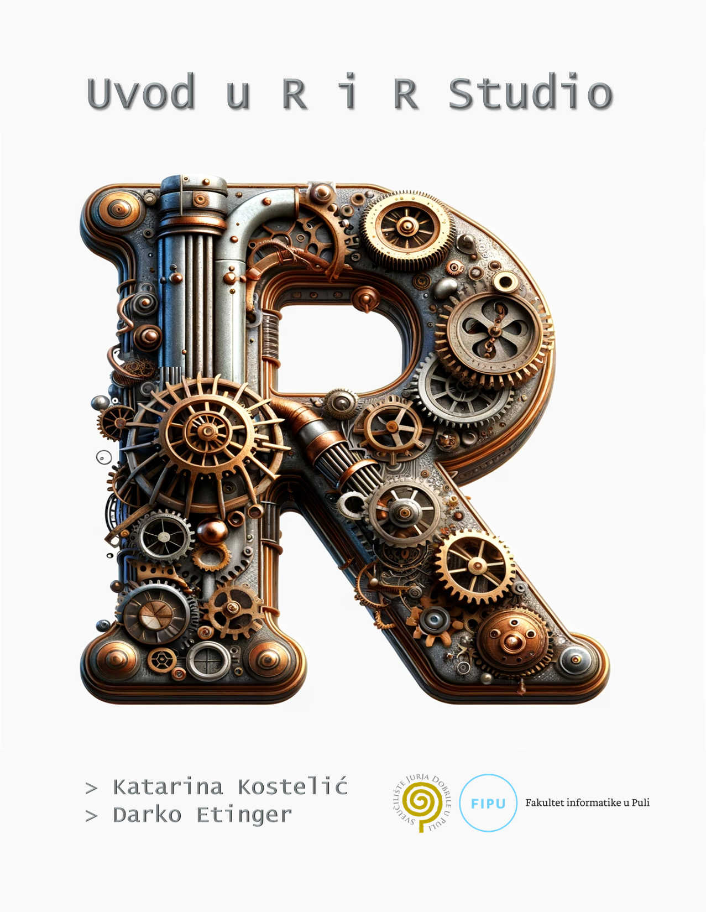

# _404{-}

Dobrodošli na mrežno izdanje priručnika **Uvod u R i R Studio**, osmišljenog kako bi vam pružio jednostavan i pristupačan uvod u programski jezik R i razvojno okruženje R Studio.

{width=50%}
  

 
 

 
 

\pagebreak

 Izdavač i sjedište 

 <strong> Sveučilište Jurja Dobrile u Puli </strong>

Zagrebačka 30, Pula

 

 Za izdavača 

 <strong> prof. dr. sc. Marinko Škare </strong>

 

 Autori

 <strong> Katarina Kostelić </strong>

 <strong> Darko Etinger </strong>

 

 Recenzenti:

 <strong> Siniša Sovilj </strong>

 <strong> Siniša Miličić </strong>

 <strong> Ivan Lorencin </strong>

 <strong> Marko Turk </strong>

 

 Lektura:

<strong> Nitor usluge d.o.o.</strong>
 
Petračićeva 4, 10000 Zagreb

 

 Grafičko oblikovanje i prijelom 

 <strong> RMarkdown, gitbook, DALL·E </strong>

 

 ISBN 978-953-377-068-0 

 

 DOI 10.17605/OSF.IO/DNFM8 

 

 Broj i datum odluke Odbora za izdavačku djelatnost:

 <strong> Sveučilišni priručnik objavljen je na temelju Odluke Odbora za izdavačku djelatnost Sveučilišta Jurja Dobrile u Puli, KLASA: 611-04/24-01/35, URBROJ: 143-01-15-24-1 od 16. prosinca 2024. godine. </strong>

\pagebreak